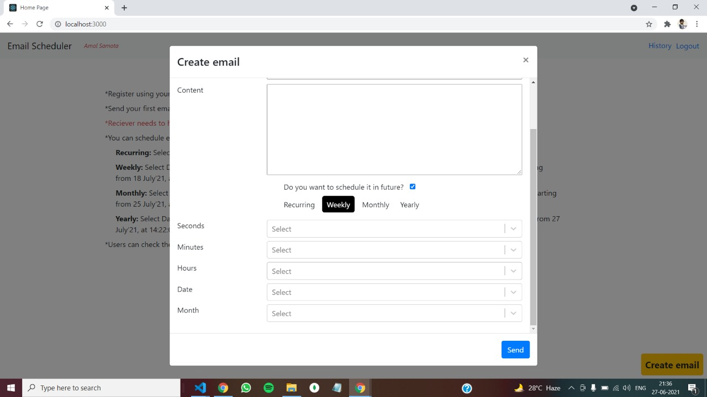
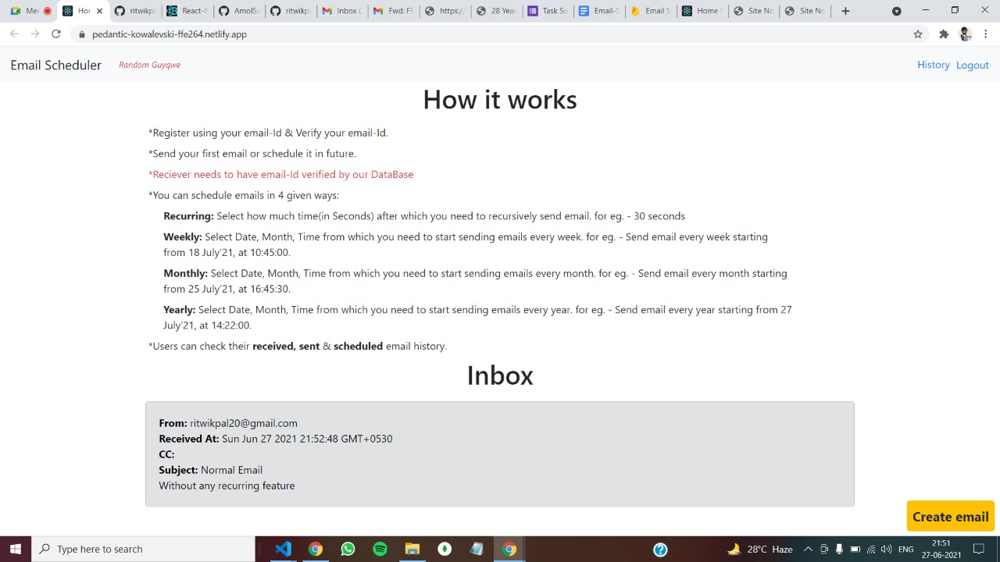
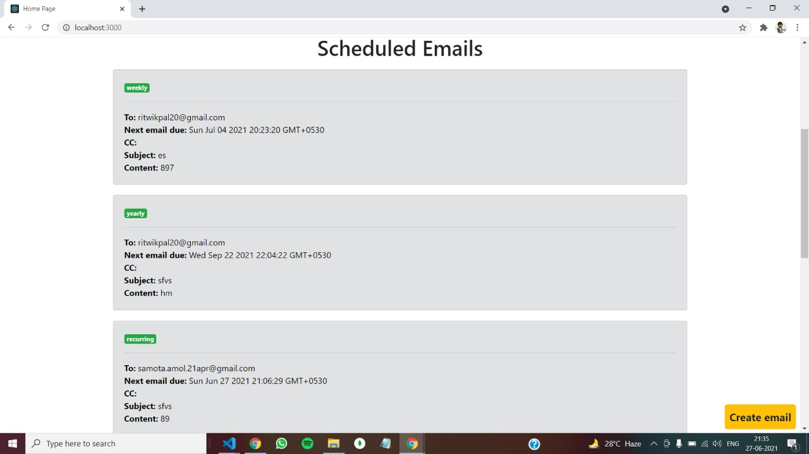

# Email Scheduler

View the website at: https://pedantic-kowalevski-ffe264.netlify.app/

This is a simple Mailchimp/Gmail functionality clone.

-   You can send mails/scheduled mail to other user.

-   The scheduled mails can be repeated reccuringly,ie,30s , or weekly or monthly or yearly.

# Pages

-   _/history_ - to view all the the mails sent by you(does not shows scheduled mails until sent)

-   On home page you can view scheduled emails and the inbox(if you have incoming emails from other users)

# Images

